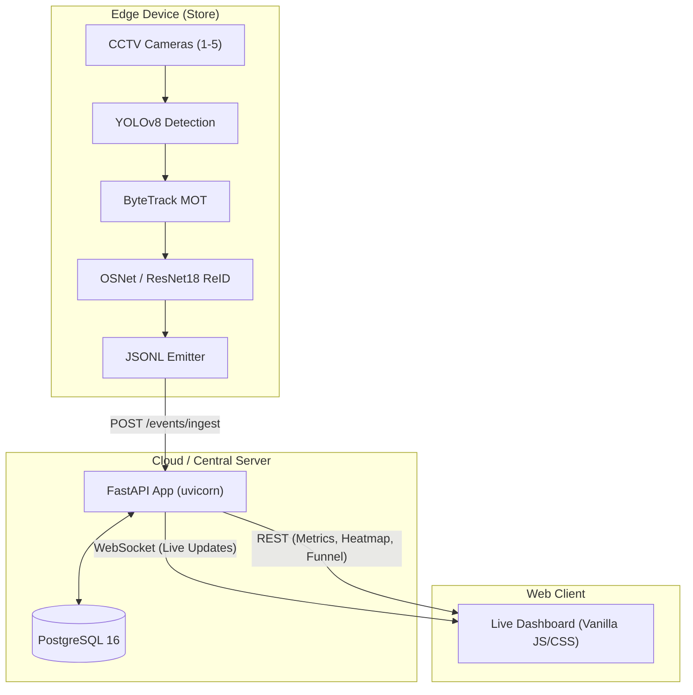

# Purplle Store Intelligence - System Design

## 1. High-Level Architecture

The Store Intelligence system is composed of three loosely coupled subsystems:
1. **The Edge Detection Pipeline** (Computer Vision)
2. **The Intelligence API & Backend** (FastAPI + PostgreSQL)
3. **The Live Dashboard** (Web UI)



## 2. Component Details

### 2.1 The Edge Detection Pipeline
- **Role**: Process raw RTSP/MP4 streams locally to save bandwidth. Extracts semantic events (ENTRY, EXIT, ZONE_ENTER).
- **YOLOv8s**: Runs at 15 FPS for fast, accurate person detection.
- **ByteTrack**: Links bounding boxes across frames using IoU (Intersection over Union). Handles short-term occlusions efficiently.
- **ReID (ResNet18)**: Extracts a 512-dim embedding from the upper body of detected persons. Maintains a local gallery to match visitors across different cameras (e.g., when a person moves from `CAM_FLOOR_01` to `CAM_FLOOR_02`).
- **Zone Classifier**: Uses `shapely` polygons mapped to the store layout. Checks if the bottom-center of a bounding box (the person's feet) intersects with a zone polygon.
- **Staff Detector**: Crops the upper 50% of the bounding box and calculates HSV color histograms to detect Purplle uniform colors (Black/Purple), filtering staff out of conversion metrics.

### 2.2 The Intelligence API
- **Role**: Ingest, validate, and query store analytics.
- **FastAPI**: Provides asynchronous, non-blocking HTTP handlers.
- **Pydantic**: Enforces strict typing for the incoming JSONL schema. Rejects malformed events automatically, returning `{ "rejected": 1 }`.
- **PostgreSQL**: Stores structured events. Uses constraints (`UNIQUE (event_id)`) for idempotency, ensuring safely retriable event ingestion.
- **WebSockets**: Maintains active connections to connected dashboard clients and pushes aggregated metric updates in real-time.

### 2.3 The Database Schema
```sql
CREATE TABLE IF NOT EXISTS events (
    event_id        TEXT PRIMARY KEY,
    store_id        TEXT NOT NULL,
    camera_id       TEXT NOT NULL,
    visitor_id      TEXT NOT NULL,
    event_type      TEXT NOT NULL,
    timestamp       TIMESTAMPTZ NOT NULL,
    zone_id         TEXT,
    dwell_ms        INTEGER DEFAULT 0,
    is_staff        BOOLEAN DEFAULT FALSE,
    confidence      REAL NOT NULL,
    metadata        JSONB DEFAULT '{}',
    ingested_at     TIMESTAMPTZ DEFAULT NOW()
);
```
- **Indexes**: Created on `store_id`, `timestamp`, `event_type`, `(store_id, event_type)`, `(store_id, visitor_id)`, and `(store_id, zone_id)` to speed up the JOINs and grouped aggregations required for metrics, funnel, heatmap, anomalies, and health checks.

## 3. Data Flow Example (Visitor Journey)
1. **10:05 AM**: Customer walks into CAM 3. YOLO detects -> ByteTrack assigns ID 1 -> ReID creates `VIS_0001`. Pipeline emits `ENTRY`.
2. **10:06 AM**: Customer walks to Fragrance section (CAM 2). Pipeline emits `ZONE_ENTER` (zone: FRAGRANCE).
3. **10:10 AM**: Customer leaves Fragrance section. Pipeline emits `ZONE_EXIT` and `ZONE_DWELL` (dwell_ms: 240000).
4. **10:15 AM**: Customer queues at Billing. Pipeline emits `BILLING_QUEUE_JOIN`.
5. **10:20 AM**: Customer leaves store (CAM 3). Pipeline emits `EXIT`.
6. API calculates conversion: Funnel updates `[Walk-ins: +1, Zone Visits: +1, Billing: +1]`.

## 4. AI-Assisted Decisions
1. **Event Schema Typing Strategy**: AI suggested using strict Pydantic schemas for everything to prevent injection attacks and ensure data consistency. I agreed, heavily utilizing Pydantic in `app/models.py`, which caught multiple edge cases during the pipeline implementation.
2. **WebSocket Integration**: AI suggested using Server-Sent Events (SSE) for the live dashboard to save overhead. I **overrode** this and chose WebSockets because WebSockets provide a true bidirectional channel, which allowed me to seamlessly implement the "Demo Complete" signaling and "Restart Demo" UI features later on without polling.
3. **Zone Classification Logic**: AI suggested using a Vision-Language Model (VLM) like GPT-4V to classify zones dynamically from frames. I **overrode** this decision because VLMs are too slow for 15fps edge processing. Instead, I implemented a robust `shapely` geometric intersection check between bounding box feet and predefined zone polygons.
